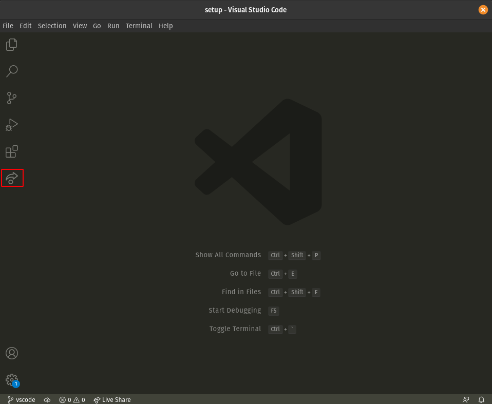

# Setup instructions

You will find below the instructions for MacOS setup.

Please **read them carefully and execute all commands in the following order**.

Let's start 🚀

- [Command line tools](##command-line-tools)
- [Prepare zsh install](##prepare-zsh-install)
- [Full installation](##full-installation)

## Command Line Tools

---

Open a new terminal, copy-paste the following command and hit `Enter`:

```bash
xcode-select --install
```

If you receive the following message, you can just skip this step and go to next step.

```bash
# command line tools are already installed, use "Software Update" to install updates
```

Otherwise, it will open a window asking you if you want to install some software: click on "Install" and wait.


✅ If you see the message "The software was installed" then all good 👍

❌ If the command `xcode-select --install` fails try again: sometimes the Apple servers are overloaded.

❌ If you see the message "Xcode is not currently available from the Software Update server", you need to update the software update catalog:

```bash
sudo softwareupdate --clear-catalog
```

Once this is done, you can try to install again.

## Prepare zsh install

---

From inside this repo, run

```bash
$ .prepare-zsh-install.sh
$ exec zsh
```

This will install:

- [Homebrew](###homebrew)
- [zsh](###zsh)
- [Oh-my-zsh](###oh-my-zsh)

### Homebrew

[Homebrew](http://brew.sh/) is a package manager: it's a software used to install other software from the command line. Let's install it!

This will ask for your confirmation (hit `Enter`) and your **macOS user account password** (the one you use to [log in](https://support.apple.com/en-gb/HT202860) when you reboot your Macbook).

:warning: When you type your password, nothing will show up on the screen, **that's normal**. This is a security feature to mask not only your password as a whole but also its length. Just type your password and when you're done, press `Enter`.

:warning: If you see this warning 👇, run the two commands in the `Next steps` section to add Homebrew to your PATH:


```bash
# ⚠️ Only execute these commands if you saw this warning ☝
echo 'eval "$(/opt/homebrew/bin/brew shellenv)"' >> ~/.zprofile
eval "$(/opt/homebrew/bin/brew shellenv)"
```

If you already have Homebrew, it will tell you so, that's fine, go on.

Then install some useful software:

```bash
brew update
```

If you get a `/usr/local must be writable` error, just run this:

```bash
sudo chown -R $USER:admin /usr/local
```

```bash
brew update
```

### zsh

Installs [Zsh](https://www.zsh.org/) homebrew formulae.

### Oh-my-zsh

Installs the `zsh` plugin [Oh My Zsh](https://ohmyz.sh/).

If asked "Do you want to change your default shell to zsh?", press `Y`

At the end your terminal should look like this:


✅ If it does, you can continue 👍

## Full installation

---

In [functions](./zsh/.functions) you can run/rerun/modify the configuration to your liking.

```bash
$ setup_dotfiles # idempotent, can be executed after every `git pull`
```

In [config](./config/) you can edit the settings to alacritty, git, iterm2, nvim, VSCode, skhdrc, tmux and yabairc.

- [Brew](###brew_setup)
- [VS code extensions](###vs-code-extensions)
- [git](###git)
- rust_setup
- fzf_setup
- navi_data_dir_setup
- npm_setup
- setup_tmux
- setup_nvim
- setup_alacritty
- sync_iterm_profile
- remap_keys
- install_ssh_ident

### brew_setup

Here is a list of the formulaes you are installing:

- gnu-sed
- cmake
- fd
- git
- jq
- gh
- wget
- python
- zsh
- navi
- yank
- ripgrep
- diff-so-fancy
- reattach-to-user-namespace
- tree-sitter
- podman
- docker-compose
- jesseduffield/lazygit/lazygit

install:

- alacritty
- iterm2
- visual-studio-code

nerd fonts:
brew tap homebrew/cask-fonts
brew install --cask font-hack-nerd-font

command line tool for processing HTML:

- https://raw.githubusercontent.com/EricChiang/pup/master/pup.rb

### setup VS code extensions

Let's install some useful extensions to VS Code. You can manually Copy-paste the following commands in your terminal:

```bash
code --install-extension Rubymaniac.vscode-paste-and-indent
```

Or just add the extensions to the [functions](./zsh/.functions).

Here is a list of the extensions you are installing:

- [Sublime Text Keymap and Settings Importer](https://marketplace.visualstudio.com/items?itemName=ms-vscode.sublime-keybindings)
- [VSCode Great Icons](https://marketplace.visualstudio.com/items?itemName=emmanuelbeziat.vscode-great-icons)
- [Live Share](https://marketplace.visualstudio.com/items?itemName=MS-vsliveshare.vsliveshare)
- [Ruby](https://marketplace.visualstudio.com/items?itemName=rebornix.Ruby)
- [ESLint](https://marketplace.visualstudio.com/items?itemName=dbaeumer.vscode-eslint)
- [Paste and Indent](https://marketplace.visualstudio.com/items?itemName=Rubymaniac.vscode-paste-and-indent)
- [SQLite](https://marketplace.visualstudio.com/items?itemName=alexcvzz.vscode-sqlite)

### setup_git

### rust_setup

### fzf_setup

### navi_data_dir_setup

### npm_setup

### setup_tmux

### setup_nvim

### setup_alacritty

### sync_iterm_profile

### remap_keys

### install_ssh_ident

## Extra stuff

### Live Share configuration

[Visual Studio Live Share](https://visualstudio.microsoft.com/services/live-share/) is a VS Code extension which allows you to share the code in your text editor for debugging and pair-programming: let's set it up!

Launch VS Code from your terminal by typing `code` and pressing `Enter`.

Click on the little arrow at the bottom of the left bar :point_down:



- Click on the "Share" button, then on "GitHub (Sign in using GitHub account)".
- A popup appears asking you to sign in with GitHub: click on "Allow".
- You are redirected to a GitHub page in you browser asking you to authorize Visual Studio Code: click on "Continue" then "Authorize github".
- VS Code may display additional pop-ups: close them by clicking "OK".

That's it, you're good to go!

## macOS Terminal Theme

Launch a terminal, click on `Terminal > Preferences` and set the "Pro" theme as default profile.


In Window tab, set also your **Window Size** to Columns: 200, Rows: 50

**Quit and restart** your terminal: it should now have a nice black background, easier on the eyes.
